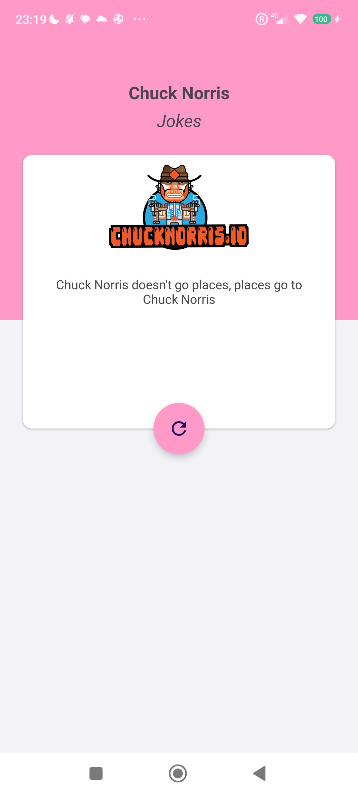

# Chuck Norris Jokes App

### Desafio 2

Este é um projeto Android que consome a API de piadas do Chuck Norris para exibir piadas engraçadas sobre o lendário Chuck Norris.

## Capturas de tela

 !

## Funcionalidades

- Integração com a API do Chuck Norris para obter piadas aleatórias.
- Exibição da piada obtida em um design de layout personalizado.
- Possibilidade de compartilhar a piada com outras pessoas por meio de aplicativos de compartilhamento padrão do Android.

## Requisitos Mínimos

### Integração com a API

A integração com a API Chuck Norris Jokes é feita usando a biblioteca Retrofit. Foi criada uma classe de serviço para lidar com as chamadas à API e processar as respostas. Foram estudados conceitos básicos de consumo de API, configuração do Retrofit, definição de interfaces de serviço com anotações Retrofit, e manipulação de respostas e erros de chamadas de API.

### Layout

O layout da aplicação segue o design proposto, utilizando atividades e layouts em XML. Foram adicionados botões e implementada a manipulação de eventos de clique.

## Bônus

### Compartilhamento

Foi adicionado um botão "Compartilhar" próximo à piada exibida. Ao clicar no botão "Compartilhar", os usuários podem compartilhar a piada usando aplicativos de compartilhamento padrão do Android, como WhatsApp, Email, SMS, etc.

### Estudo Adicional

O projeto também explorou o uso de Intents para a funcionalidade de compartilhamento, permitindo que os usuários compartilhem as piadas de forma rápida e fácil.

## Autor

Este desafio foi desenvolvido por Kássio Luz

---
